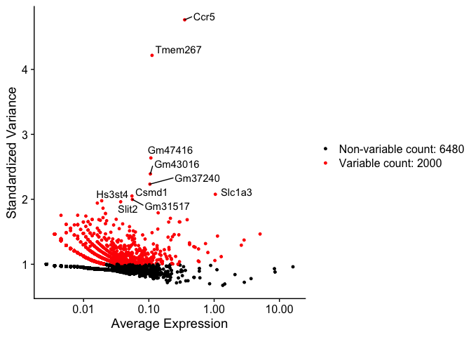

Seurat basic workflow for single nuclei analysis
================

## Summary

Workflow to analyze single nuclei data starting with the following input
files : - barcode.tsv - features.tsv - matrix.mtx

Those files are obtained after the cellranger pipeline or Starsolo.

## Pipeline

### Packages

``` r
library(scater)
```

    ## Loading required package: SingleCellExperiment

    ## Loading required package: SummarizedExperiment

    ## Loading required package: GenomicRanges

    ## Loading required package: stats4

    ## Loading required package: BiocGenerics

    ## Loading required package: parallel

    ## 
    ## Attaching package: 'BiocGenerics'

    ## The following objects are masked from 'package:parallel':
    ## 
    ##     clusterApply, clusterApplyLB, clusterCall, clusterEvalQ,
    ##     clusterExport, clusterMap, parApply, parCapply, parLapply,
    ##     parLapplyLB, parRapply, parSapply, parSapplyLB

    ## The following objects are masked from 'package:stats':
    ## 
    ##     IQR, mad, sd, var, xtabs

    ## The following objects are masked from 'package:base':
    ## 
    ##     anyDuplicated, append, as.data.frame, basename, cbind,
    ##     colnames, dirname, do.call, duplicated, eval, evalq, Filter,
    ##     Find, get, grep, grepl, intersect, is.unsorted, lapply, Map,
    ##     mapply, match, mget, order, paste, pmax, pmax.int, pmin,
    ##     pmin.int, Position, rank, rbind, Reduce, rownames, sapply,
    ##     setdiff, sort, table, tapply, union, unique, unsplit, which,
    ##     which.max, which.min

    ## Loading required package: S4Vectors

    ## 
    ## Attaching package: 'S4Vectors'

    ## The following object is masked from 'package:base':
    ## 
    ##     expand.grid

    ## Loading required package: IRanges

    ## Loading required package: GenomeInfoDb

    ## Loading required package: Biobase

    ## Welcome to Bioconductor
    ## 
    ##     Vignettes contain introductory material; view with
    ##     'browseVignettes()'. To cite Bioconductor, see
    ##     'citation("Biobase")', and for packages 'citation("pkgname")'.

    ## Loading required package: DelayedArray

    ## Loading required package: matrixStats

    ## 
    ## Attaching package: 'matrixStats'

    ## The following objects are masked from 'package:Biobase':
    ## 
    ##     anyMissing, rowMedians

    ## Loading required package: BiocParallel

    ## 
    ## Attaching package: 'DelayedArray'

    ## The following objects are masked from 'package:matrixStats':
    ## 
    ##     colMaxs, colMins, colRanges, rowMaxs, rowMins, rowRanges

    ## The following objects are masked from 'package:base':
    ## 
    ##     aperm, apply, rowsum

    ## Loading required package: ggplot2

    ## 
    ## Attaching package: 'scater'

    ## The following object is masked from 'package:S4Vectors':
    ## 
    ##     rename

    ## The following object is masked from 'package:stats':
    ## 
    ##     filter

``` r
library(Seurat)
```

    ## Registered S3 method overwritten by 'R.oo':
    ##   method        from       
    ##   throw.default R.methodsS3

    ## 
    ## Attaching package: 'Seurat'

    ## The following object is masked from 'package:SummarizedExperiment':
    ## 
    ##     Assays

### Uploading data

\*\* to fill in
\*\*

``` r
path="/Users/njaure/Documents/Main_thesis_project/10Xdata_second_try/starsolo_genefull"
project_name="AL_0919"
min_cells=3
min_feat=70
```

``` r
# Initialize the Seurat object with the raw (non-normalized data).
raw.data <- Read10X(data.dir = path)

so_data <- CreateSeuratObject(counts = raw.data, project = project_name, min.cells = min_cells, min.features = min_feat)
so_data
```

    ## An object of class Seurat 
    ## 8480 features across 1108 samples within 1 assay 
    ## Active assay: RNA (8480 features)

  - min cell and min features to adjust based on next plot

#### Count of features per cells

``` r
VlnPlot(so_data, features = c("nFeature_RNA", "nCount_RNA"), ncol = 2)
```

<!-- -->

#### Normalization and most variable features

\*\* to fill in \*\*

``` r
n_feat=2000
```

``` r
so_data <- NormalizeData(so_data)
so_data<- FindVariableFeatures(so_data, selection.method = "vst", nfeatures = n_feat)
```

    ## Warning in simpleLoess(y, x, w, span, degree = degree, parametric =
    ## parametric, : pseudoinverse used at -2.5863

    ## Warning in simpleLoess(y, x, w, span, degree = degree, parametric =
    ## parametric, : neighborhood radius 0.24072

    ## Warning in simpleLoess(y, x, w, span, degree = degree, parametric =
    ## parametric, : reciprocal condition number 1.4291e-14

    ## Warning in simpleLoess(y, x, w, span, degree = degree, parametric =
    ## parametric, : There are other near singularities as well. 0.01561

``` r
# Identify the 10 most highly variable genes
top10 <- head(VariableFeatures(so_data), 10)

# plot variable features with and without labels
plot1 <- VariableFeaturePlot(so_data)
plot2 <- LabelPoints(plot = plot1, points = top10, repel = TRUE)
```

    ## Warning: Using `as.character()` on a quosure is deprecated as of rlang 0.3.0.
    ## Please use `as_label()` or `as_name()` instead.
    ## This warning is displayed once per session.

    ## When using repel, set xnudge and ynudge to 0 for optimal results

``` r
plot2
```

<!-- -->

#### PCA

``` r
all.genes <- rownames(so_data)
so_data <- ScaleData(so_data, features = all.genes)
```

    ## Centering and scaling data matrix

``` r
#PCA plot
so_data <- RunPCA(so_data, features = VariableFeatures(object = so_data))
```

    ## PC_ 1 
    ## Positive:  Ghr, Tshr, Atp1a2, Slc1a3, Cidec, Gm26917, Tenm4, Sorbs1, Mgll, Comt 
    ##     Ctcflos, Sgcd, Plcb1, Ppfia3, Gm4876, Art3, Nnat, Sox6, Tns1, Eepd1 
    ##     Txlng, Npr3, Dlc1, Pnpla3, Ccdc80, Pcx, Pparg, Dst, Sntb1, Shroom3 
    ## Negative:  Myo1f, Gas7, Atp6v0d2, Ccr5, Tshz2, Fam129b, Cd300a, Zfpm2, Cd300lb, Atp8b1 
    ##     Wipf1, Runx1, Gm43016, Gm37240, Tgfbi, Adamts12, Ciita, Gm17749, Galnt17, Gpc6 
    ##     Nrros, Alpk1, Cmah, Calhm2, Trerf1, Fndc1, Trim2, Plxdc2, Rbpj, Pcdh7 
    ## PC_ 2 
    ## Positive:  D930007P13Rik, Trpm6, Ica1, Iqcm, Tmem178, AC138306.1, Apba2, Prex2, Gm41335, Gm29724 
    ##     Cd109, Ros1, Ggt5, Hs3st4, Bsn, B230214G05Rik, Tshz2, Gm47790, Gm31374, Grk5 
    ##     Adamts12, Zfpm2, Arhgap32, Chrm3, Adam12, Atp8b1, Naaladl2, Sdk1, C1qtnf7, Dlc1 
    ## Negative:  Myo1f, Cd300lb, Runx1, Atp6v0d2, Gm37240, Cd300a, Gm43016, Gm17749, Ccr5, Pid1 
    ##     Fam129b, Tgfbi, Nrros, Ppfia3, Mctp1, Itgb2, Ciita, Cntnap5a, Epsti1, Dao 
    ##     Cd300c2, Tenm4, Gm42418, Tshr, 4930567K12Rik, Mrc1, Tmem104, Elf2, Cd36, F7 
    ## PC_ 3 
    ## Positive:  Tshz2, Zfpm2, Adam12, Dpysl3, Adamts12, Dlc1, Robo1, Atp8b1, Naaladl2, Adamts2 
    ##     Gpc6, Lhfp, Sdk1, Gm830, Galnt17, Fndc1, Gm15675, Slit2, C1qtnf7, Gm16833 
    ##     Trabd2b, Rtn1, Lama2, Slc35d1, Vit, Plce1, Pdgfrb, Ror1, Sox5, Arhgap24 
    ## Negative:  Myo1f, Trpm6, Ccr5, Gm41335, D930007P13Rik, Ros1, Atp6v0d2, Iqcm, Apba2, Ica1 
    ##     AC138306.1, Gm29724, Cd109, Gm47790, Tmem178, Gm43016, Hs3st4, Gm37240, Cd300lb, Runx1 
    ##     Ggt5, Cd300a, Grk5, Gm31374, Cd36, Prex2, Prkcb, Pid1, B230214G05Rik, Bsn 
    ## PC_ 4 
    ## Positive:  Dao, 4930567K12Rik, A330015K06Rik, Gm20755, Cd302, D130009I18Rik, Cntnap5a, 4930511M18Rik, Stab2, Zfp366 
    ##     Iqcm, Fat2, Gm29724, Cd109, 5730522E02Rik, Ghr, Ggt5, Apba2, Gm29010, Gm15288 
    ##     Arhgap24, Slc1a3, Cp, Gm12426, Aebp1, Ptms, Fstl5, Sox6, Rasa3, Gcnt2 
    ## Negative:  Agl, Frmd3, Pde5a, Gm26512, Megf9, Ccdc162, Gm12861, Tmem260, Cdh22, Ftsj1 
    ##     Spag6, Galm, Fryl, Stox2, Amotl1, Ttyh3, Atp6v0d2, Ccr5, Cask, Gm43016 
    ##     Clasp2, Lncppara, Myo1f, Atg4a, Dip2a, Epha5, Cd300lb, Acss1, Malat1, Gm37240 
    ## PC_ 5 
    ## Positive:  4930567K12Rik, Dao, A330015K06Rik, Gm20755, D130009I18Rik, Cntnap5a, Zfp366, Stab2, 4930511M18Rik, 5730522E02Rik 
    ##     Gm29010, Fstl5, Gm39204, Gm973, Fat2, Cd302, Frmd3, Gm12861, Ccdc162, Agl 
    ##     Hydin, Pdzrn4, Megf9, Pde5a, Csmd1, Cyp11a1, Ascc3, Ryr2, Suds3, Adgrb3 
    ## Negative:  Tmem120b, Tenm4, Plxna2, Matn2, Rnf24, Atp1a2, Cndp1, Hmgb1, Pdzrn3, Trafd1 
    ##     Blcap, Ranbp3, Igsf8, Fam227a, Pmepa1, Dpysl3, Ak2, Stx8, Tspan18, Fndc1 
    ##     Chpt1, Fshr, Taok2, Cd300c2, Tbc1d24, Comt, Tmc6, Pex14, Dcakd, Sdhaf3

``` r
DimPlot(so_data, reduction = "pca")
```

<!-- -->

##### select number of principal components to keep maximum of variability

``` r
ElbowPlot(so_data)
```

<!-- -->

#### Compute clustering

\*\* to fill in \*\*

``` r
n_dims=1:10
resol=0.8
```

``` r
so_data <- FindNeighbors(so_data, dims = n_dims)
```

    ## Computing nearest neighbor graph

    ## Computing SNN

``` r
so_data <- FindClusters(so_data, resolution = resol)
```

    ## Modularity Optimizer version 1.3.0 by Ludo Waltman and Nees Jan van Eck
    ## 
    ## Number of nodes: 1108
    ## Number of edges: 43787
    ## 
    ## Running Louvain algorithm...
    ## Maximum modularity in 10 random starts: 0.7564
    ## Number of communities: 6
    ## Elapsed time: 0 seconds
